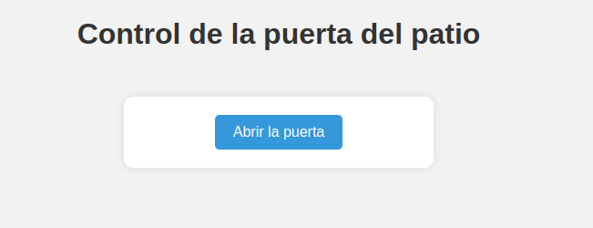

# Control Remoto de Portero FERMAX con el ESP32.

La finalidad de este proyecto es abrir la puerta del patio utilizando un portero de la marca FERMAX y la placa ESP32.

Si tienes un videoportero de FERMAX, sabrás que si mantienes pulsado el botón de la cámara, tendrás una imagen en vivo de lo que sucede en el portal. Ahora bien, mientras la cámara esté activada, si pulsas sobre el botón de la llave, la puerta del patio se desbloquea y seguidamente se lanza el siguiente aviso: "puerta abierta. Por favor, cierre después de entrar".

Esto me llevó a pensar: ¿y si replicamos este proceso sin necesidad de tener nosotros que pulsar los botones?

## Electrónica.

## ESP32.

El ESP32 tiene la capacidad de correr un servidor web, por ello, he creado una pequeña página web con un botón que dice: "Abrir la puerta". Cuando se pulsa este botón, el ESP32 realiza las siguientes acciones:

1. Activar el LED y el relé encargado de activar la cámara.
2. Esperar 2500ms.
3. Desactivar el relé de la cámara.
4. Esperar 500ms.
5. Activar el relé encargado de abrir la puerta.
6. Esperar 500ms.
7. Desactivar el relé de la puerta.
8. Esperar 500ms.
9. Activar el relé de la cámara.
10. Esperar 500ms.
11. Desactivar LED y relé de la cámara.

Hay que tener en cuenta una cosa, y es que cuando desactivamos el relé de la cámara (que es lo mismo que dejar de pulsar el botón de la cámara), la cámara no se apaga hasta pasados unos segundos o hasta que se vuelva a pulsar el botón. Por ello, en la acción número 9 se vuelve a activar el relé de la cámara. Que como hemos dicho, esto hará que se apague la cámara ya que previamente estaba encendida.
